# Pansharpening-Zoo

    

# 	Supervised

- `[ICCV 2017 PanNet]`  [[paper]](https://ieeexplore.ieee.org/document/8237455) [[code]](https://github.com/oyam/PanNet-Landsat) J. Yang, X. Fu, Y. Hu, Y. Huang, X. Ding and J. Paisley, "PanNet: A Deep Network Architecture for Pan-Sharpening," 2017 IEEE International Conference on Computer Vision (ICCV), Venice, Italy, 2017, pp. 1753-1761, doi: 10.1109/ICCV.2017.193.

  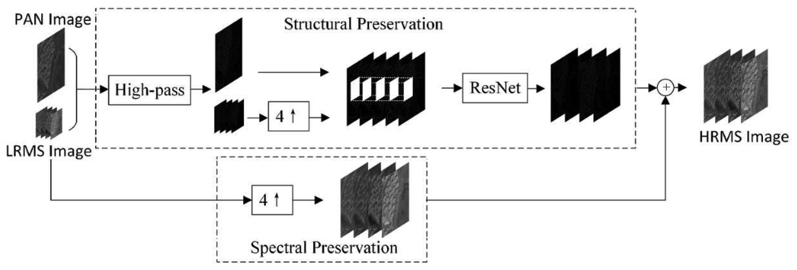

- `[CVPR 2021 SIPSA-Net]` [[paper]](https://ieeexplore.ieee.org/document/9578431) [[code]](https://github.com/brachiohyup/SIPSA) J. Lee, S. Seo and M. Kim, "SIPSA-Net: Shift-Invariant Pan Sharpening with Moving Object Alignment for Satellite Imagery," 2021 IEEE/CVF Conference on Computer Vision and Pattern Recognition (CVPR), Nashville, TN, USA, 2021, pp. 10161-10169, doi: 10.1109/CVPR46437.2021.01003. 

  

- `[ECCV 2022 MMNet]` [[paper]](https://link.springer.com/chapter/10.1007/978-3-031-19800-7_18) [[code]](https://github.com/Keyu-Yan/MMNet) Yan, K., Zhou, M., Zhang, L., Xie, C. (2022). Memory-Augmented Model-Driven Network for Pansharpening. In: Avidan, S., Brostow, G., Cissé, M., Farinella, G.M., Hassner, T. (eds) Computer Vision – ECCV 2022. ECCV 2022. Lecture Notes in Computer Science, vol 13679. Springer, Cham. https://doi.org/10.1007/978-3-031-19800-7_18 

  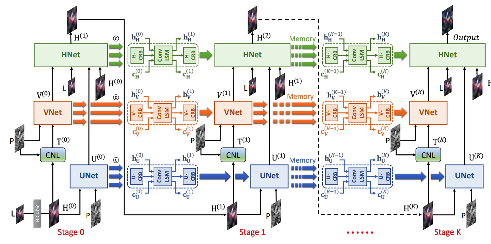

- `[CVPR 2023  PGCU]` [[paper]](https://arxiv.org/abs/2303.13659) [[code]](https://github.com/Zeyu-Zhu/PGCU) Z. Zhu, X. Cao, M. Zhou, J. Huang, and D. Meng, “Probability-Based Global Cross-Modal Upsampling for Pansharpening,” in Proceedings of the IEEE/CVF Conference on Computer Vision and Pattern Recognition (CVPR), Jun. 2023, pp. 14039–14048. 

  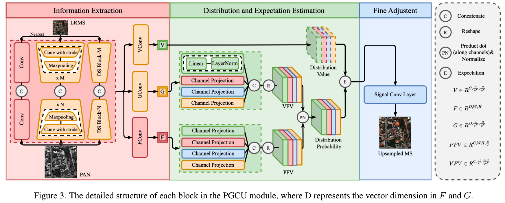

- `[TGRS 2021  PSGAN]` [[paper]](https://ieeexplore.ieee.org/document/9306912) [[code]](https://github.com/zhysora/PSGan-Family) Q. Liu, H. Zhou, Q. Xu, X. Liu and Y. Wang, "PSGAN: A Generative Adversarial Network for Remote Sensing Image Pan-Sharpening," in IEEE Transactions on Geoscience and Remote Sensing, vol. 59, no. 12, pp. 10227-10242, Dec. 2021, doi: 10.1109/TGRS.2020.3042974. 

  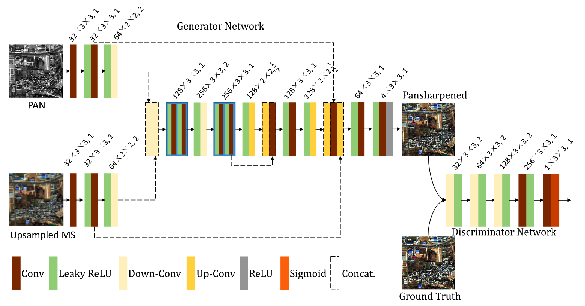

- `[CVPR 2022  HyperTransformer]` [[paper]](https://ieeexplore.ieee.org/document/9880014) [[code]](https://github.com/wgcban/HyperTransformer) W. G. C. Bandara and V. M. Patel, "HyperTransformer: A Textural and Spectral Feature Fusion Transformer for Pansharpening," 2022 IEEE/CVF Conference on Computer Vision and Pattern Recognition (CVPR), New Orleans, LA, USA, 2022, pp. 1757-1767, doi: 10.1109/CVPR52688.2022.00181. 

  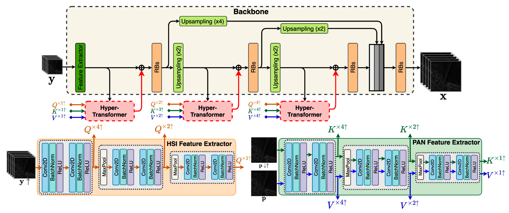

- `[CVPR 2021 GPPNN]` [[paper]](https://ieeexplore.ieee.org/document/9578619) [[code]](https://github.com/shuangxu96/GPPNN) S. Xu, J. Zhang, Z. Zhao, K. Sun, J. Liu and C. Zhang, "Deep Gradient Projection Networks for Pan-sharpening," 2021 IEEE/CVF Conference on Computer Vision and Pattern Recognition (CVPR), Nashville, TN, USA, 2021, pp. 1366-1375, doi: 10.1109/CVPR46437.2021.00142.  

  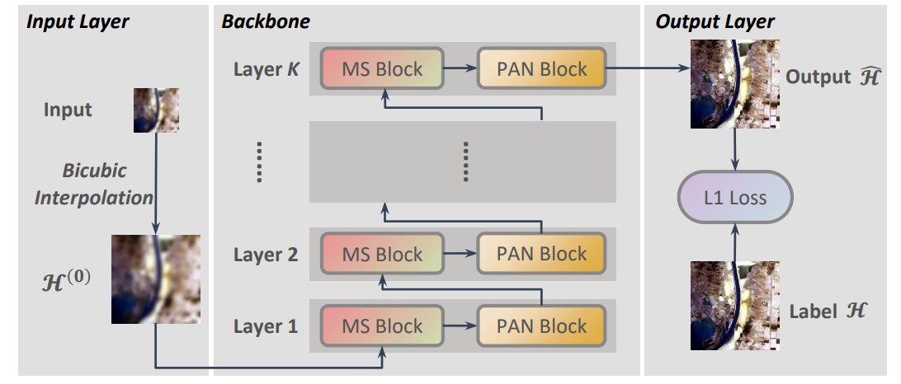

- `[TGRS 2022 DIP-HyperKite]` [[paper]](https://ieeexplore.ieee.org/document/9664535) [[code]](https://github.com/wgcban/DIP-HyperKite) W. G. C. Bandara, J. M. J. Valanarasu and V. M. Patel, "Hyperspectral Pansharpening Based on Improved Deep Image Prior and Residual Reconstruction," in IEEE Transactions on Geoscience and Remote Sensing, vol. 60, pp. 1-16, 2022, Art no. 5520816, doi: 10.1109/TGRS.2021.3139292.  

  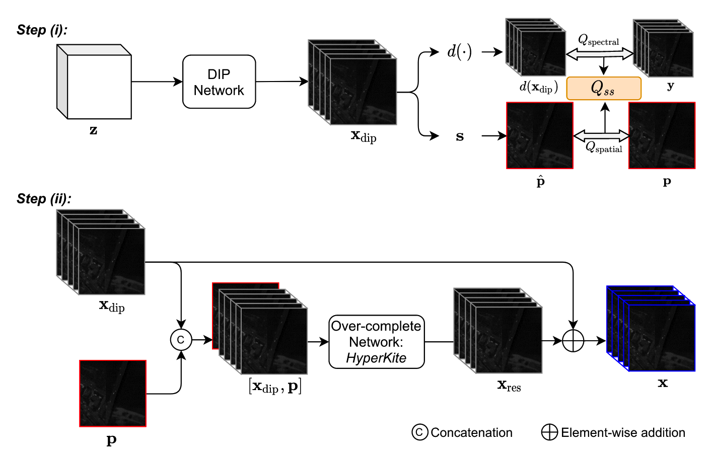

# Unsupervised

+ `[TGRS 2022 Z-PNN]` [[paper]](https://ieeexplore.ieee.org/document/9745494) [[code]](https://github.com/matciotola/Z-PNN) M. Ciotola, S. Vitale, A. Mazza, G. Poggi and G. Scarpa, "Pansharpening by Convolutional Neural Networks in the Full Resolution Framework," in IEEE Transactions on Geoscience and Remote Sensing, vol. 60, pp. 1-17, 2022, Art no. 5408717, doi: 10.1109/TGRS.2022.3163887. 
  
  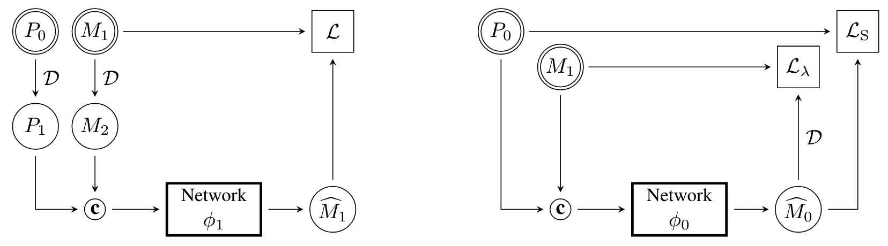

+ `[TGRS 2022 UCGAN]` [[paper]](https://ieeexplore.ieee.org/document/9755137) [[code]](https://github.com/zhysora/UCGAN) H. Zhou, Q. Liu, D. Weng and Y. Wang, "Unsupervised Cycle-Consistent Generative Adversarial Networks for Pan Sharpening," in IEEE Transactions on Geoscience and Remote Sensing, vol. 60, pp. 1-14, 2022, Art no. 5408814, doi: 10.1109/TGRS.2022.3166528. 

  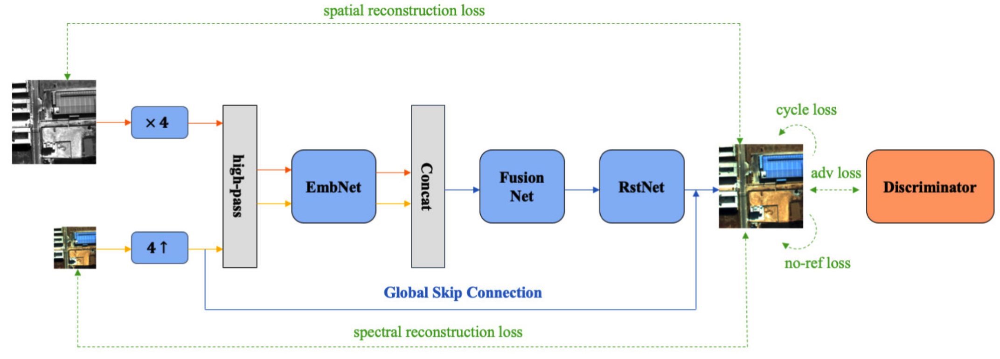
  
+ `[arxiv 2023 PLRDiff]` [[paper]](https://arxiv.org/pdf/2305.10925.pdf) [[code]](https://github.com/xyrui/PLRDiff) Unsupervised Pansharpening via Low-rank Diffusion Model. 

  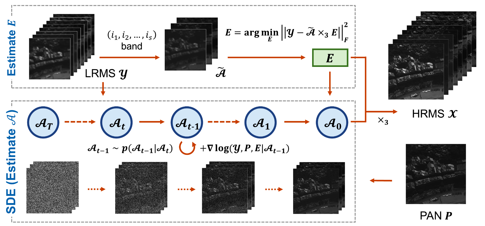
  
+ `[INFORM FUSION 2020 Pan-GAN]` [[paper]](https://www.sciencedirect.com/science/article/abs/pii/S1566253520302591) [[code]](https://github.com/yuwei998/PanGAN) J. Ma, W. Yu, C. Chen, P. Liang, X. Guo, and J. Jiang, “Pan-GAN: An unsupervised pan-sharpening method for remote sensing image fusion,” Information Fusion, vol. 62, pp. 110–120, 2020, doi: https://doi.org/10.1016/j.inffus.2020.04.006.

  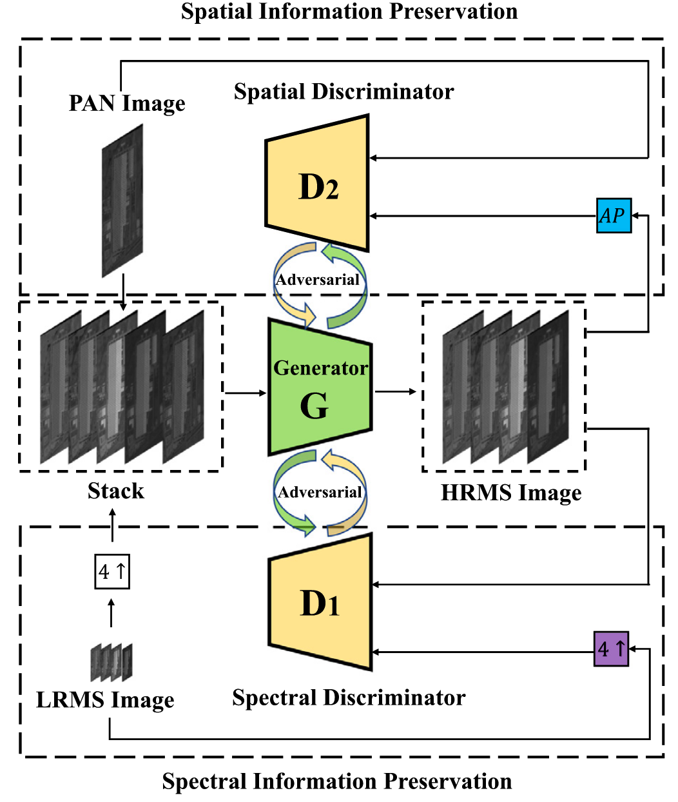

+ `[J-STARS 2020]` [[paper]](https://ieeexplore.ieee.org/document/9136909) [code] S. Luo, S. Zhou, Y. Feng and J. Xie, "Pansharpening via Unsupervised Convolutional Neural Networks," in IEEE Journal of Selected Topics in Applied Earth Observations and Remote Sensing, vol. 13, pp. 4295-4310, 2020, doi: 10.1109/JSTARS.2020.3008047. 

  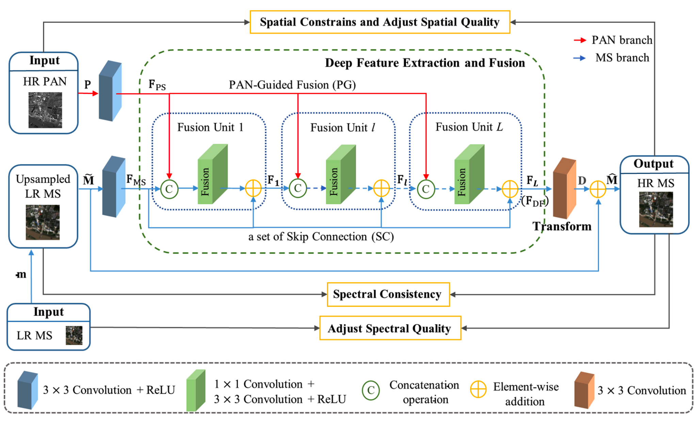

