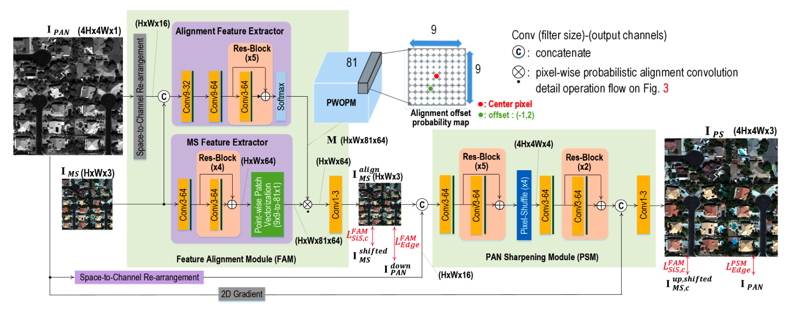
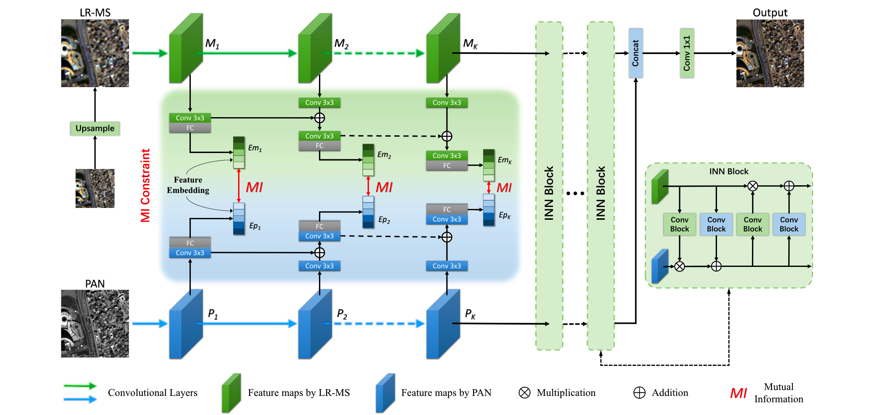
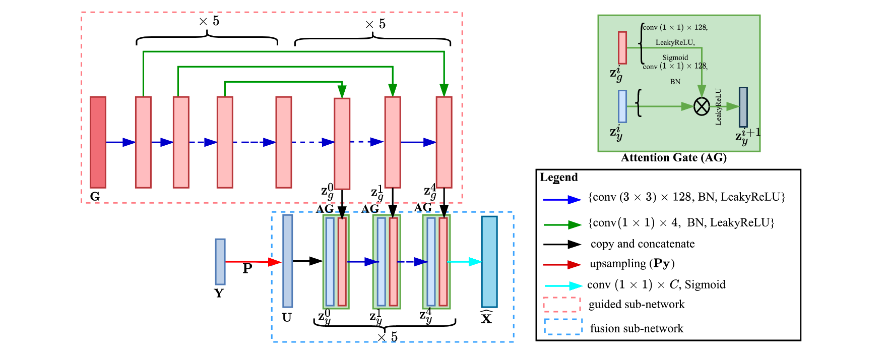

# Pansharpening-Zoo

    

Version without images, see [this](./README-clean.md). 

Quick retrieval by searching \<journal/conf abbreviation>\<space>\<year>.

# 	Supervised

- `[ICCV 2017 PanNet]`  [[paper]](https://ieeexplore.ieee.org/document/8237455) [[code]](https://github.com/oyam/PanNet-Landsat) J. Yang, X. Fu, Y. Hu, Y. Huang, X. Ding and J. Paisley, "**PanNet: A Deep Network Architecture for Pan-Sharpening**," *<ins>2017 IEEE International Conference on Computer Vision (ICCV)</ins>*, Venice, Italy, 2017, pp. 1753-1761, doi: 10.1109/ICCV.2017.193.

  

- `[CVPR 2021 SIPSA-Net]` [[paper]](https://ieeexplore.ieee.org/document/9578431) [[code]](https://github.com/brachiohyup/SIPSA) J. Lee, S. Seo and M. Kim, "**SIPSA-Net: Shift-Invariant Pan Sharpening with Moving Object Alignment for Satellite Imagery**," *<ins>2021 IEEE/CVF Conference on Computer Vision and Pattern Recognition (CVPR)</ins>*, Nashville, TN, USA, 2021, pp. 10161-10169, doi: 10.1109/CVPR46437.2021.01003. 

  

- `[ECCV 2022 MMNet]` [[paper]](https://link.springer.com/chapter/10.1007/978-3-031-19800-7_18) [[code]](https://github.com/Keyu-Yan/MMNet) Yan, K., Zhou, M., Zhang, L., Xie, C. (2022). **Memory-Augmented Model-Driven Network for Pansharpening**. In: Avidan, S., Brostow, G., Cissé, M., Farinella, G.M., Hassner, T. (eds) Computer Vision – ECCV 2022. *<ins>ECCV 2022</ins>*. Lecture Notes in Computer Science, vol 13679. Springer, Cham. https://doi.org/10.1007/978-3-031-19800-7_18 

  

- `[CVPR 2023  PGCU]` [[paper]](https://arxiv.org/abs/2303.13659) [[code]](https://github.com/Zeyu-Zhu/PGCU) Z. Zhu, X. Cao, M. Zhou, J. Huang, and D. Meng, “**Probability-Based Global Cross-Modal Upsampling for Pansharpening**,” in *<ins>Proceedings of the IEEE/CVF Conference on Computer Vision and Pattern Recognition (CVPR)</ins>*, Jun. 2023, pp. 14039–14048. 

  

- `[TGRS 2021  PSGAN]` [[paper]](https://ieeexplore.ieee.org/document/9306912) [[code]](https://github.com/zhysora/PSGan-Family) Q. Liu, H. Zhou, Q. Xu, X. Liu and Y. Wang, "**PSGAN: A Generative Adversarial Network for Remote Sensing Image Pan-Sharpening**," in *<ins>IEEE Transactions on Geoscience and Remote Sensing</ins>*, vol. 59, no. 12, pp. 10227-10242, Dec. 2021, doi: 10.1109/TGRS.2020.3042974. 

  

- `[CVPR 2022  HyperTransformer]` [[paper]](https://ieeexplore.ieee.org/document/9880014) [[code]](https://github.com/wgcban/HyperTransformer) W. G. C. Bandara and V. M. Patel, "**HyperTransformer: A Textural and Spectral Feature Fusion Transformer for Pansharpening**," *<ins>2022 IEEE/CVF Conference on Computer Vision and Pattern Recognition (CVPR)</ins>*, New Orleans, LA, USA, 2022, pp. 1757-1767, doi: 10.1109/CVPR52688.2022.00181. 

  

- `[CVPR 2021 GPPNN]` [[paper]](https://ieeexplore.ieee.org/document/9578619) [[code]](https://github.com/shuangxu96/GPPNN) S. Xu, J. Zhang, Z. Zhao, K. Sun, J. Liu and C. Zhang, "**Deep Gradient Projection Networks for Pan-sharpening**," *<ins>2021 IEEE/CVF Conference on Computer Vision and Pattern Recognition (CVPR)</ins>*, Nashville, TN, USA, 2021, pp. 1366-1375, doi: 10.1109/CVPR46437.2021.00142.  

  

- `[TGRS 2022 DIP-HyperKite]` [[paper]](https://ieeexplore.ieee.org/document/9664535) [[code]](https://github.com/wgcban/DIP-HyperKite) W. G. C. Bandara, J. M. J. Valanarasu and V. M. Patel, "**Hyperspectral Pansharpening Based on Improved Deep Image Prior and Residual Reconstruction**," in *<ins>IEEE Transactions on Geoscience and Remote Sensing</ins>*, vol. 60, pp. 1-16, 2022, Art no. 5520816, doi: 10.1109/TGRS.2021.3139292.  

  
  
- `[CVPR 2022 MDCUN]` [[paper]](https://ieeexplore.ieee.org/document/9880283) [[code]](https://github.com/manman1995/Awaresome-pansharpening) [[code]](https://github.com/yggame/MDCUN) G. Yang, M. Zhou, K. Yan, A. Liu, X. Fu and F. Wang, "**Memory-augmented Deep Conditional Unfolding Network for Pansharpening**," *<ins>2022 IEEE/CVF Conference on Computer Vision and Pattern Recognition (CVPR)</ins>*, New Orleans, LA, USA, 2022, pp. 1778-1787, doi: 10.1109/CVPR52688.2022.00183.

  
  
- `[CVPR 2022 MutInf]` [[paper]](https://ieeexplore.ieee.org/document/9880283) [[code]](https://github.com/manman1995/Awaresome-pansharpening) [[code]](https://github.com/manman1995/Mutual-Information-driven-Pan-sharpening) M. Zhou, K. Yan, J. Huang, Z. Yang, X. Fu and F. Zhao, "**Mutual Information-driven Pan-sharpening**," *<ins>2022 IEEE/CVF Conference on Computer Vision and Pattern Recognition (CVPR)</ins>*, New Orleans, LA, USA, 2022, pp. 1788-1798, doi: 10.1109/CVPR52688.2022.00184.

  
  
- `[AAAI 2022 panformer]` [[paper]](https://ojs.aaai.org/index.php/AAAI/article/view/20267) [[code]](https://github.com/manman1995/Awaresome-pansharpening) Zhou, M., Huang, J., Fang, Y., Fu, X., & Liu, A. (2022). **Pan-Sharpening with Customized Transformer and Invertible Neural Network**. *<ins>Proceedings of the AAAI Conference on Artificial Intelligence</ins>*, 36(3), 3553-3561. https://doi.org/10.1609/aaai.v36i3.20267

  

- `[ICCV 2021 DCFNet]` [[paper]](https://ieeexplore.ieee.org/document/9710135) [[code]](https://github.com/XiaoXiao-Woo/UDL) X. Wu, T. -Z. Huang, L. -J. Deng and T. -J. Zhang, "**Dynamic Cross Feature Fusion for Remote Sensing Pansharpening**," *<ins>2021 IEEE/CVF International Conference on Computer Vision (ICCV)</ins>*, Montreal, QC, Canada, 2021, pp. 14667-14676, doi: 10.1109/ICCV48922.2021.01442.

  

- `[ECCV 2022 SFIIN]` [[paper]](https://link.springer.com/chapter/10.1007/978-3-031-19797-0_16) [[code]](https://github.com/manman1995/Awaresome-pansharpening) Zhou, M. et al. (2022). **Spatial-Frequency Domain Information Integration for Pan-Sharpening**. In: Avidan, S., Brostow, G., Cissé, M., Farinella, G.M., Hassner, T. (eds) Computer Vision – ECCV 2022. *<ins>ECCV 2022</ins>*. Lecture Notes in Computer Science, vol 13678. Springer, Cham. https://doi.org/10.1007/978-3-031-19797-0_16

  

- `[CVPR 2019 MHF-net]` [[paper]](https://ieeexplore.ieee.org/document/8953470) [[code]](https://github.com/XieQi2015/MHF-net) Q. Xie, M. Zhou, Q. Zhao, D. Meng, W. Zuo and Z. Xu, "**Multispectral and Hyperspectral Image Fusion by MS/HS Fusion Net**," *<ins>2019 IEEE/CVF Conference on Computer Vision and Pattern Recognition (CVPR)</ins>*, Long Beach, CA, USA, 2019, pp. 1585-1594, doi: 10.1109/CVPR.2019.00168.

  
  
- `[J-STARS 2020 MIPSM]` [[paper]](https://ieeexplore.ieee.org/document/9042292) [code] L. Liu et al., "**Shallow–Deep Convolutional Network and Spectral-Discrimination-Based Detail Injection for Multispectral Imagery Pan-Sharpening**," in *<ins>IEEE Journal of Selected Topics in Applied Earth Observations and Remote Sensing</ins>*, vol. 13, pp. 1772-1783, 2020, doi: 10.1109/JSTARS.2020.2981695.

  
  
- `[TNNLS 2021]` [[paper]](https://ieeexplore.ieee.org/document/9106801) [code] X. Fu, W. Wang, Y. Huang, X. Ding and J. Paisley, "**Deep Multiscale Detail Networks for Multiband Spectral Image Sharpening**," in *<ins>IEEE Transactions on Neural Networks and Learning Systems</ins>*, vol. 32, no. 5, pp. 2090-2104, May 2021, doi: 10.1109/TNNLS.2020.2996498.

  
  
- `[TGRS 2020 FusionNet]` [[paper]](https://ieeexplore.ieee.org/document/9240949) [[code]](https://github.com/liangjiandeng/FusionNet) L. -J. Deng, G. Vivone, C. Jin and J. Chanussot, "**Detail Injection-Based Deep Convolutional Neural Networks for Pansharpening**," in *<ins>IEEE Transactions on Geoscience and Remote Sensing</ins>*, vol. 59, no. 8, pp. 6995-7010, Aug. 2021, doi: 10.1109/TGRS.2020.3031366.

  
  
- `[RS 2016 PNN]` [[paper]](https://www.mdpi.com/2072-4292/8/7/594) [[code]](https://github.com/shenkqtx/PNN) Masi, G.; Cozzolino, D.; Verdoliva, L.; Scarpa, G. **Pansharpening by Convolutional Neural Networks**. *<ins>Remote Sens</ins>*. 2016, 8, 594. https://doi.org/10.3390/rs8070594

  
  
- `[TGRS 2022 DR-Net]` [[paper]](https://ieeexplore.ieee.org/document/9715116/) [code] X. Su, J. Li and Z. Hua, "**Transformer-Based Regression Network for Pansharpening Remote Sensing Images**," in *<ins>IEEE Transactions on Geoscience and Remote Sensing</ins>*, vol. 60, pp. 1-23, 2022, Art no. 5407423, doi: 10.1109/TGRS.2022.3152425.

  

- `[ICME 2022 PanFormer]` [[paper]](https://ieeexplore.ieee.org/document/9859770/) [[code]](https://github.com/zhysora/PanFormer) H. Zhou, Q. Liu and Y. Wang, "**PanFormer: A Transformer Based Model for Pan-Sharpening**," *<ins>2022 IEEE International Conference on Multimedia and Expo (ICME)</ins>*, Taipei, Taiwan, 2022, pp. 1-6, doi: 10.1109/ICME52920.2022.9859770.

  

- `[CVPRW 2022 DII]` [[paper]](https://ieeexplore.ieee.org/document/9857173) [code] J. Gao, J. Li, X. Su, M. Jiang and Q. Yuan, "**Deep Image Interpolation: A Unified Unsupervised Framework for Pansharpening**," *<ins>2022 IEEE/CVF Conference on Computer Vision and Pattern Recognition Workshops (CVPRW)</ins>*, New Orleans, LA, USA, 2022, pp. 608-617, doi: 10.1109/CVPRW56347.2022.00076.

  
  
- `[TGRS 2023 FAFNet]` [[paper]](https://ieeexplore.ieee.org/abstract/document/10142023) [[code]](https://github.com/YinghuiXing/FAFNet) Y. Xing, Y. Zhang, H. He, X. Zhang and Y. Zhang, "**Pansharpening via Frequency-Aware Fusion Network With Explicit Similarity Constraints**," in *<ins>IEEE Transactions on Geoscience and Remote Sensing</ins>*, vol. 61, pp. 1-14, 2023, Art no. 5403614, doi: 10.1109/TGRS.2023.3281829.

  
  
- `[TGRS 2023 PSCF-Net]` [[paper]](https://ieeexplore.ieee.org/abstract/document/10081055) [[code]](https://github.com/ahu-dsp/PSCF-Net) S. Peng, D. Zhu, Q. Gao, Y. Lu and D. Sun, "**PSCF-Net: Deeply Coupled Feedback Network for Pansharpening**," in *<ins>IEEE Transactions on Geoscience and Remote Sensing</ins>*, vol. 61, pp. 1-12, 2023, Art no. 5401812, doi: 10.1109/TGRS.2023.3261386.

  
  
- `[TGRS 2023 PSDNet]` [[paper]](https://ieeexplore.ieee.org/document/10064074) [[code]](https://github.com/Meiqi-Gong/PSDNet) M. Gong, H. Zhang, H. Xu, X. Tian and J. Ma, "**Multipatch Progressive Pansharpening With Knowledge Distillation**," in *<ins>IEEE Transactions on Geoscience and Remote Sensing</ins>*, vol. 61, pp. 1-15, 2023, Art no. 5401115, doi: 10.1109/TGRS.2023.3254053.
  
  

- `[TGRS 2023 S2DBPN]` [[paper]](https://ieeexplore.ieee.org/document/10102272) [[code]](https://github.com/RSMagneto/S2DBPN) K. Zhang, A. Wang, F. Zhang, W. Wan, J. Sun and L. Bruzzone, "**Spatial-Spectral Dual Back-Projection Network for Pansharpening**," in *<ins>IEEE Transactions on Geoscience and Remote Sensing</ins>*, vol. 61, pp. 1-16, 2023, Art no. 5402216, doi: 10.1109/TGRS.2023.3266799.

  

- `[TGRS 2023 CADUI]` [[paper]](https://ieeexplore.ieee.org/document/10103692) [code] Z. Li, J. Li, F. Zhang and L. Fan, "**CADUI: Cross-Attention-Based Depth Unfolding Iteration Network for Pansharpening Remote Sensing Images**," in *<ins>IEEE Transactions on Geoscience and Remote Sensing</ins>*, vol. 61, pp. 1-20, 2023, Art no. 5402420, doi: 10.1109/TGRS.2023.3267841.

  

- `[TGRS 2023 LNM-PS]` [[paper]](https://ieeexplore.ieee.org/document/10097537) [[code]](https://github.com/liangjiandeng/-LNM-PS) R. Wen, L. -J. Deng, Z. -C. Wu, X. Wu and G. Vivone, "**A Novel Spatial Fidelity With Learnable Nonlinear Mapping for Panchromatic Sharpening**," in *<ins>IEEE Transactions on Geoscience and Remote Sensing</ins>*, vol. 61, pp. 1-15, 2023, Art no. 5401915, doi: 10.1109/TGRS.2023.3265404.

  

- `[TGRS 2023 UAPN]` [[paper]](https://ieeexplore.ieee.org/document/10106462) [[code]](https://github.com/keviner1/UAPN) K. Zheng, J. Huang, M. Zhou, D. Hong and F. Zhao, "**Deep Adaptive Pansharpening via Uncertainty-Aware Image Fusion**," in *<ins>IEEE Transactions on Geoscience and Remote Sensing</ins>*, vol. 61, pp. 1-15, 2023, Art no. 5403715, doi: 10.1109/TGRS.2023.3269139.

  

- `[TGRS 2023 CFF]` [[paper]](https://ieeexplore.ieee.org/document/10196102) [code] C. Ke, W. Zhang, Z. Wang, J. Ma and X. Tian, "**Coarse-to-fine Cross-domain Learning Fusion Network for Pansharpening**," in *<ins>IEEE Transactions on Geoscience and Remote Sensing</ins>*, doi: 10.1109/TGRS.2023.3299336.

  

- `[TGRS 2023 ABFNet]` [[paper]](https://ieeexplore.ieee.org/document/10185614) [code]X. Zhao, J. Guo, Y. Zhang and Y. Wu, "**Asymmetric Bidirectional Fusion Network for Remote Sensing Pansharpening**," in *<ins>IEEE Transactions on Geoscience and Remote Sensing</ins>*, vol. 61, pp. 1-16, 2023, Art no. 5404816, doi: 10.1109/TGRS.2023.3296510.

  

- `[TGRS 2023 UTSN]` [[paper]](https://ieeexplore.ieee.org/document/10139827) [[code]](https://github.com/RSMagneto/UTSN) Z. Sheng, F. Zhang, J. Sun, Y. Tan, K. Zhang and L. Bruzzone, "**A Unified Two-Stage Spatial and Spectral Network With Few-Shot Learning for Pansharpening**," in *<ins>IEEE Transactions on Geoscience and Remote Sensing</ins>*, vol. 61, pp. 1-17, 2023, Art no. 5403517, doi: 10.1109/TGRS.2023.3281602.
  
  

- `[TGRS 2023 NLUNet]` [[paper]](https://ieeexplore.ieee.org/document/10155438) [code] X. Li, Y. Li, G. Shi, L. Zhang, W. Li and D. Lei, "**Pansharpening Method Based on Deep Nonlocal Unfolding**," in *<ins>IEEE Transactions on Geoscience and Remote Sensing</ins>*, vol. 61, pp. 1-11, 2023, Art no. 5404111, doi: 10.1109/TGRS.2023.3287532.

  

- `[NeurIPS 2022 ARFNet]` [[paper]](https://papers.nips.cc/paper_files/paper/2022/hash/89ef9ce35c7833cba14bb2381ead6c54-Abstract-Conference.html) [[code]](https://github.com/manman1995/Awaresome-pansharpening/blob/main/model/arfnet-NIPS.py) K. Yan et al., “**Panchromatic and Multispectral Image Fusion via Alternating Reverse Filtering Network**,” in *<ins>Advances in Neural Information Processing Systems</ins>*, 2022, vol. 35, pp. 21988–22002. [Online]. Available: https://proceedings.neurips.cc/paper_files/paper/2022/file/89ef9ce35c7833cba14bb2381ead6c54-Paper-Conference.pdf

- `[ICCV 2023 PanFlowNet]` [[paper]](https://arxiv.org/abs/2305.07774) [code] Gang Yang, Xaingyong Cao, Wenzhe Xiao, Man Zhou, Aiping Liu, Xun Chen, Deyu Meng. **PanFlowNet: A Flow-Based Deep Network for Pan-sharpening**[C]//*<ins>Proceedings of the IEEE/CVF International Conference on Computer Vision(ICCV)</ins>*. 2023.

  

# Unsupervised

+ `[TGRS 2022 Z-PNN]` [[paper]](https://ieeexplore.ieee.org/document/9745494) [[code]](https://github.com/matciotola/Z-PNN) M. Ciotola, S. Vitale, A. Mazza, G. Poggi and G. Scarpa, "**Pansharpening by Convolutional Neural Networks in the Full Resolution Framework**," in *<ins>IEEE Transactions on Geoscience and Remote Sensing</ins>*, vol. 60, pp. 1-17, 2022, Art no. 5408717, doi: 10.1109/TGRS.2022.3163887. 
  
  

+ `[TGRS 2022 UCGAN]` [[paper]](https://ieeexplore.ieee.org/document/9755137) [[code]](https://github.com/zhysora/UCGAN) H. Zhou, Q. Liu, D. Weng and Y. Wang, "**Unsupervised Cycle-Consistent Generative Adversarial Networks for Pan Sharpening**," in *<ins>IEEE Transactions on Geoscience and Remote Sensing</ins>*, vol. 60, pp. 1-14, 2022, Art no. 5408814, doi: 10.1109/TGRS.2022.3166528. 

  
  
+ `[ArXiv 2023 PLRDiff]` [[paper]](https://arxiv.org/abs/2305.10925) [[code]](https://github.com/xyrui/PLRDiff) Rui, X., Cao, X., Zhu, Z., Yue, Z., & Meng, D. (2023). **Unsupervised Pansharpening via Low-rank Diffusion Model**. *<ins>ArXiv</ins>*, abs/2305.10925. 

  
  
+ `[INFORM FUSION 2020 Pan-GAN]` [[paper]](https://www.sciencedirect.com/science/article/abs/pii/S1566253520302591) [[code]](https://github.com/yuwei998/PanGAN) J. Ma, W. Yu, C. Chen, P. Liang, X. Guo, and J. Jiang, “**Pan-GAN: An unsupervised pan-sharpening method for remote sensing image fusion**,” *<ins>Information Fusion</ins>*, vol. 62, pp. 110–120, 2020, doi: https://doi.org/10.1016/j.inffus.2020.04.006.

  

+ `[J-STARS 2020]` [[paper]](https://ieeexplore.ieee.org/document/9136909) [code] S. Luo, S. Zhou, Y. Feng and J. Xie, "**Pansharpening via Unsupervised Convolutional Neural Networks**," in *<ins>IEEE Journal of Selected Topics in Applied Earth Observations and Remote Sensing</ins>*, vol. 13, pp. 4295-4310, 2020, doi: 10.1109/JSTARS.2020.3008047. 

  

+ `[GRSL 2022 MetaPan]` [[paper]](https://ieeexplore.ieee.org/document/9854889) [code] D. Wang, P. Zhang, Y. Bai and Y. Li, "**MetaPan: Unsupervised Adaptation With Meta-Learning for Multispectral Pansharpening**," in *<ins>IEEE Geoscience and Remote Sensing Letters</ins>*, vol. 19, pp. 1-5, 2022, Art no. 5513505, doi: 10.1109/LGRS.2022.3198141.

  

+ `[TGRS 2020 UP-SAM]` [[paper]](https://ieeexplore.ieee.org/document/9146721) [code] Y. Qu, R. K. Baghbaderani, H. Qi and C. Kwan, "**Unsupervised Pansharpening Based on Self-Attention Mechanism**," in *<ins>IEEE Transactions on Geoscience and Remote Sensing</ins>*, vol. 59, no. 4, pp. 3192-3208, April 2021, doi: 10.1109/TGRS.2020.3009207.

  

+ `[CVPR 2020 UAL]` [[paper]](https://ieeexplore.ieee.org/document/9157441) [[code]](https://github.com/JiangtaoNie/UAL) L. Zhang, J. Nie, W. Wei, Y. Zhang, S. Liao and L. Shao, "**Unsupervised Adaptation Learning for Hyperspectral Imagery Super-Resolution**," *<ins>2020 IEEE/CVF Conference on Computer Vision and Pattern Recognition (CVPR)</ins>*, Seattle, WA, USA, 2020, pp. 3070-3079, doi: 10.1109/CVPR42600.2020.00314.

  

+ `[TGRS 2022 SURE]` [[paper]](https://ieeexplore.ieee.org/document/9924190) [[code]](https://github.com/hvn2/Deep-SURE-Fusion) LH. V. Nguyen, M. O. Ulfarsson, J. R. Sveinsson and M. Dalla Mura, "**Deep SURE for Unsupervised Remote Sensing Image Fusion**," in *<ins>IEEE Transactions on Geoscience and Remote Sensing</ins>*, vol. 60, pp. 1-13, 2022, Art no. 5412613, doi: 10.1109/TGRS.2022.3215902.

  

+ `[J-STARS 2022 LDP-Net]` [[paper]](https://ieeexplore.ieee.org/document/9814841) [[code]](https://github.com/suifenglian/LDP-Net) J. Ni et al., "**LDP-Net: An Unsupervised Pansharpening Network Based on Learnable Degradation Processes**," in *<ins>IEEE Journal of Selected Topics in Applied Earth Observations and Remote Sensing</ins>*, vol. 15, pp. 5468-5479, 2022, doi: 10.1109/JSTARS.2022.3188181.

  

+ `[J-STARS 2021 PGMAN]` [[paper]](https://ieeexplore.ieee.org/document/9463717) [[code]](https://github.com/zhysora/PGMAN) H. Zhou, Q. Liu and Y. Wang, "**PGMAN: An Unsupervised Generative Multiadversarial Network for Pansharpening**," in *<ins>IEEE Journal of Selected Topics in Applied Earth Observations and Remote Sensing</ins>*, vol. 14, pp. 6316-6327, 2021, doi: 10.1109/JSTARS.2021.3090252.
  

+ `[TGRS 2023 Lambda-PNN]` [[paper]](https://ieeexplore.ieee.org/document/10198408) [[code]](https://github.com/matciotola/Lambda-PNN) M. Ciotola, G. Poggi and G. Scarpa, "**Unsupervised Deep Learning-based Pansharpening with Jointly-Enhanced Spectral and Spatial Fidelity**," in *<ins>IEEE Transactions on Geoscience and Remote Sensing</ins>*, doi: 10.1109/TGRS.2023.3299356.

  

+ `[TGRS 2023 Mun-GAN]` [[paper]](https://ieeexplore.ieee.org/document/10159248) [code] X. Liu, X. Liu, H. Dai, X. Kang, A. Plaza and W. Zu, "**Mun-GAN: A Multiscale Unsupervised Network for Remote Sensing Image Pansharpening**," in *<ins>IEEE Transactions on Geoscience and Remote Sensing</ins>*, vol. 61, pp. 1-18, 2023, Art no. 5404018, doi: 10.1109/TGRS.2023.3288073.

